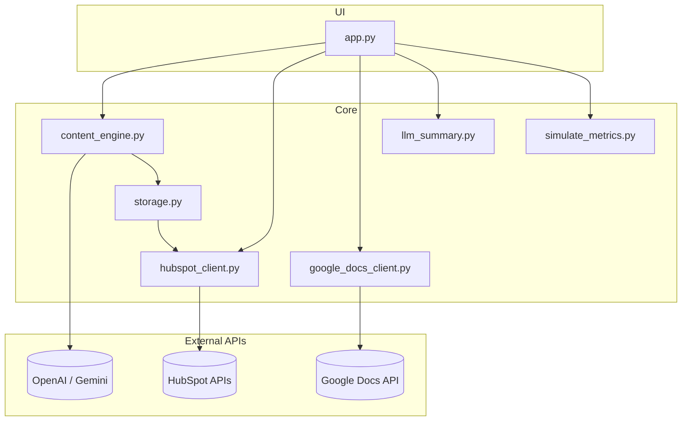
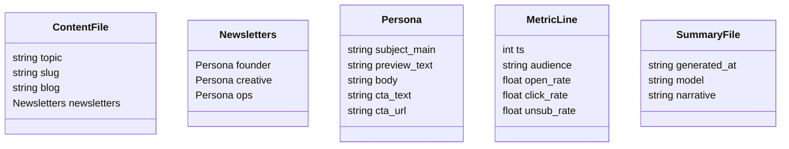

# 🧠 Syntra AI — Automated Marketing Content Pipeline

A fully functional AI-powered marketing pipeline that **generates, distributes, and optimizes blog and newsletter content** using **OpenAI / Gemini + HubSpot APIs**, built for the **🧪 AI-Powered Marketing Content Pipeline** take-home assignment.

---

## 📌 Overview

Syntra AI is a lightweight, modular automation system that turns a **single topic input** into:
1. A complete AI-generated **blog post** (≈600 words)
2. Three **persona-tailored newsletters** (Founder, Creative, Ops)
3. A published **Google Doc**, ready for CMS use
4. Automated **HubSpot distribution** (segmented sending via API)
5. Continuous **performance tracking and AI-driven optimization**

## Personas (defaults in the app)

**Founder**
Early-stage startup owners, solo CEOs, or small business founders.
Focus: ROI, speed to value, lean stacks, “ship it now.”
Examples: solo SaaS founder, boutique agency owner, non-technical CEO.

**Creative**
Designers, copywriters, content strategists, creative directors.
Focus: idea quality, faster concepting, better briefs/assets, time saved.
Examples: brand designer, social content lead, freelance copywriter.

**Ops (Operations)**
People who keep workflows running: ops managers, revops/marketing ops.
Focus: reliability, integrations, governance, scale, low-maintenance automations.
Examples: operations manager, revops analyst, marketing ops specialist.

**How they’re wired into the app**

In code we map UI keys → HubSpot enum values:

founder → startup_founder

creative → creative_professional

ops → ops_manager

The contact property created/used in HubSpot is audience_persona (a select field) with those three options.

The newsletter generator tailors tone and content to each persona’s priorities (ROI for founders, inspiration/time-savings for creatives, reliability/integration for ops).

Segmentation/sending uses this property to target the right version.

The app runs both **locally** and on **Streamlit Cloud** — no manual steps once configured.

---

## ⚙️ Architecture

### System Flow
```mermaid
flowchart LR
  A[User enters Topic] --> B[LLM Engine\n(OpenAI/Gemini)]
  B --> C[Blog (≈600w)]
  B --> D[3 Newsletters\nFounder / Creative / Ops]
  C --> E[Storage\n/data/content/*.json]
  D --> E
  E --> F[Google Docs\nPublish Post]
  E --> G[HubSpot CRM\nContacts + Lists]
  G --> H[Single-Send API\nPer Persona]
  H --> I[Delivery / Inbox]

  subgraph Performance Loop
    I --> J[Metrics (sim/real)\n/data/perf/metrics.jsonl]
    J --> K[AI Summary\nllm_summary.py → summary.json]
    K --> L[Next-Topic Hints\n(optional)]
    L -. informs .-> B
  end
```

### Component Map


---

## 🧩 Tech Stack

| Category | Tool / API | Notes |
|-----------|-------------|-------|
| **Language Model** | OpenAI GPT-3.5-Turbo / Gemini 1.5 | Blog and newsletter generation |
| **CRM Integration** | HubSpot Single-Send & CRM APIs | Contacts, lists, email sending |
| **Docs Integration** | Google Docs API | Publishes generated posts |
| **Framework** | Streamlit | Simple UI for orchestration |
| **Storage** | JSON & JSONL files | Portable flat-file persistence |
| **Auth & Secrets** | .env / Streamlit Secrets | API keys + tokens |
| **Cloud Hosting** | Streamlit Cloud / Local | Seamless deployment |

---

## 🧱 Folder Structure

```
ai_marketing_pipeline/
├── app.py
├── content_engine.py
├── hubspot_client.py
├── google_docs_client.py
├── storage.py
├── simulate_metrics.py
├── llm_summary.py
│
├── data/
│   ├── content/
│   ├── perf/
│   └── crm/
│
├── .env
├── requirements.txt
└── README.md
```

---

## 🔐 Environment Setup

Create a `.env` file in the root:

```
LLM_PROVIDER=openai
OPENAI_API_KEY=sk-xxxx
HUBSPOT_PRIVATE_APP_TOKEN=pat-xxxx
HUBSPOT_EMAIL_TEMPLATE_ID=1234567890
HUBSPOT_SEND_ENABLED=true
BLOG_BASE_URL=https://syntra.ai/blog
HUBSPOT_PORTAL_TIMEZONE=America/New_York
```

> If `HUBSPOT_PRIVATE_APP_TOKEN` is missing, the app runs entirely in **simulation mode**.

---

## 🚀 Installation

### Local Setup
```
git clone https://github.com/masrar000/ai_marketing_pipeline.git
cd ai_marketing_pipeline
pip install -r requirements.txt
streamlit run app.py
```

### Streamlit Cloud
1. Push to GitHub
2. Go to [share.streamlit.io](https://share.streamlit.io/)
3. Deploy → Add secrets
4. Streamlit auto-creates required folders

---

## 🗂 Data Schema


---

## 💡 HubSpot Setup & Scopes

HubSpot no longer uses legacy API keys — create a **Private App**:

1. In HubSpot: **Settings → Integrations → Private Apps**
2. Add these scopes:
   - `crm.objects.contacts.read`, `crm.objects.contacts.write`
   - `crm.lists.read`, `crm.lists.write`
   - `marketing-email`
3. Copy token → add to `.env` as `HUBSPOT_PRIVATE_APP_TOKEN`

If your plan doesn’t allow API sends, the app automatically **simulates** them.

---

## 📊 Data Model Summary

| File | Purpose |
|------|----------|
| `data/content/*.json` | Stores blog + newsletters |
| `data/crm/send_log.jsonl` | Records each campaign |
| `data/perf/metrics.jsonl` | Logs open/click/unsub rates |
| `data/perf/summary.json` | AI summary of campaign performance |

---

## 🧮 Workflow Summary
1. Input topic → AI generates blog & newsletters  
2. Save to `/data/content/*.json`  
3. Optional: Create Google Doc  
4. Distribute via HubSpot or simulate send  
5. Log results and performance metrics  
6. Summarize performance using LLM insights  

---

## 👤 Author
**Sarim (masrar000)**  
📍 Data Scientist 
🔗 [GitHub](https://github.com/masrar000) | [LinkedIn](https://www.linkedin.com/in/muhammadsarimasrar)
